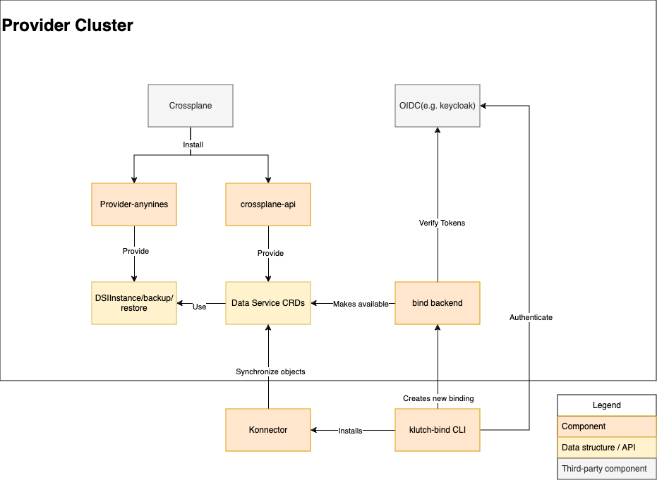

# Developing Klutch

This document should help you get started developing Klutch, in case you want to contribute to the
project.
## Component overview

Klutch consists of multiple components that fulfill different roles. You can find them in the
different folders of this repository. The diagram shows the different modules and how information
flows between them, but does not represent the folder structure explained below.

## Folder overview
The following section explains the folder structure of this repository.
* **bind** enables usage of Klutch's APIs across different Kubernetes clusters by synchronizing
  state between the management cluster and API consumer clusters. To find out more about developing
  the bind subcomponent check out [the development instructions](./bind/DEVELOPING.md).Bind has
  multiple sub-components, which all are located in the `bind` directory:
  * **backend**: backend implementation is open to different approaches, as long as they follow the
    standard. The repo comes with an example-backend, that shows how a backend can be implemented.
    The backend authenticates new users via OIDC before creating a binding space on the consumer
    cluster for them.
  * **konnector**: this component gets installed in the consumer's cluster and is responsible for
    synchronization between the management cluster and the consumer cluster.
  * **kubectl-bind** plugin: a CLI for creating a binding. This gets called by a user if they want
    to bind an API. The CLI initiates the OIDC auth process and installs the konnector into the
    user's cluster.
* **clients** houses client libraries for the a9s data services, and open service broker api
  implementations. They are used by **provider-anynines** which implements a crossplane provider to
  adapt the open service broker APIs to Kubernetes objects.
* **crossplane-api** contains crossplane configuration packages. These are indirections that allow
  the creation of opinionated Kubernetes resources that only expose the information the platform
  operator wants to expose to their users.
* **release** contains automation for creating release bundles that make the installation easier by
  bundling all steps into only two manifests.
* **provider-anynines** is a crossplane provider that maps the open service broker API provided by
  the anynines data services, and other APIs, such as backups and restores to Crossplane resources
  for use in **crossplane-api**. The exposed resources are not meant for direct consumption, but as
  building blocks for opinionated services, like the ones built in **crossplane-api**
