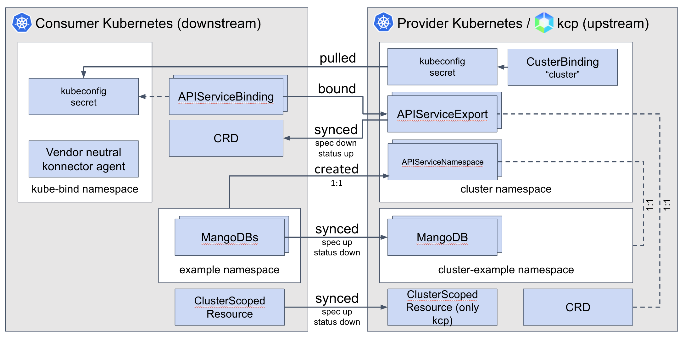

</img>

# Klutch-bind

## What is it?

Klutch-bind aims to provide better support for service providers and consumers that reside in distinct Kubernetes clusters.

- A service provider defines its API in terms of CRDs and associated permission claims/limitations, and exports it for use from other clusters.
- Service consumers identify the services they want to consume.
- The service CRDs get installed in the service consumer clusters, with objects of the defined kinds written and read by the service consumers.
- The service provider indirectly reads and writes those objects as the interface to the service that it provides.
- The service provider does not inject controllers/operators into the service consumer's cluster.
- A single vendor-neutral, OpenSource agent per consumer cluster connects it with the requested services.

## Try it out

This is the 3 line pitch:

*TODO*

```shell
$ kubectl krew index add bind https://github.com/kube-bind/krew-index.git
$ kubectl krew install klutch/bind
$ kubectl bind https://mangodb/exports
Redirect to the brower to authenticate via OIDC.
BOOM – the MangoDB API is available in the local cluster, 
       without anything MangoDB-specific running.
$ kubectl get mangodbs 
```

## Technical Overview

</img>

All the actions shown between the clusters are done by the konnector, except: the pull at the start is done by the kubectl plugin that installs the konnector.

## Usage

To run the current backend, there must be an OIDC issuer installed in place to do the
the oauth2 workflow.

We use dex to manage OIDC, following the steps below you can run a local OIDC issuer using dex:
* First, clone the dex repo: `git clone https://github.com/dexidp/dex.git`
* `cd dex` and then build the dex binary `make build`
* The binary will be created in `bin/dex`
* Adjust the config file(`examples/config-dev.yaml`) for dex by specifying the server callback method:
```yaml
staticClients:
- id: kube-bind
  redirectURIs:
  - 'http://127.0.0.1:8080/callback'
  name: 'Klutch'
```
* Run dex: `./bin/dex serve examples/config-dev.yaml`

Next you should be able to run the backend. For it you need a kubernetes cluster (e.g. kind)
accessible.

***Note: make sure before running the backend that you have the dex server up and running as mentioned above
and that you have at least one k8s cluster. Take a look at the backend option in the cmd/main.go file***

* apply the CRDs: `kubectl apply -f deploy/crd`
* In order to populate binding list on website, we need a CRD with label `klutch.anynines.com/exported: true`. Apply example CRD: `kubectl apply -f deploy/examples/crd-mangodb.yaml`
* start the backend binary with the right flags:
```shell
$ make build
$ bin/example-backend \
  --oidc-issuer-client-secret=ZXhhbXBsZS1hcHAtc2VjcmV0 \
  --oidc-issuer-client-id=kube-bind \
  --oidc-issuer-url=http://127.0.0.1:5556/dex \
  --oidc-callback-url=http://127.0.0.1:8080/callback \
  --pretty-name="BigCorp.com" \
  --namespace-prefix="kube-bind-" \
  --cookie-signing-key=bGMHz7SR9XcI9JdDB68VmjQErrjbrAR9JdVqjAOKHzE= \
  --cookie-encryption-key=wadqi4u+w0bqnSrVFtM38Pz2ykYVIeeadhzT34XlC1Y=
```

where `ZXhhbXBsZS1hcHAtc2VjcmV0` matches the value of the dex config file.

The `--cookie-signing-key` and `--cookie-encryption-key` settings can be generated using:
```shell
$ openssl rand -base64 32
WQh88mNOY0Z3tLy1/WOud7qIEEBxz+POc4j8BsYenYo=
```

The `--cookie-signing-key` option is required and supports 32 and 64 byte lengths.
The `--cookie-encryption-key` option is optional and supports byte lengths of 16, 24, 32 for AES-128, AES-192, or AES-256.

* with a KUBECONFIG against another cluster (a consumer cluster) bind a service: `kubectl bind http://127.0.0.1:8080/export`.
