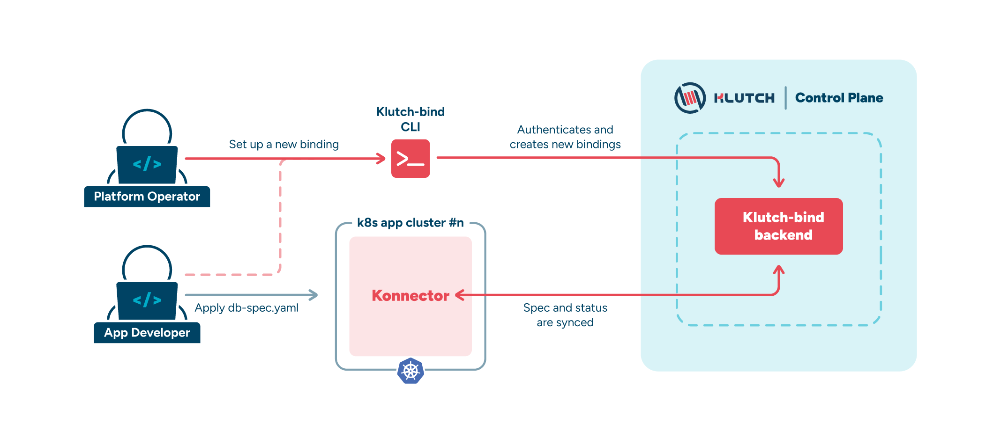
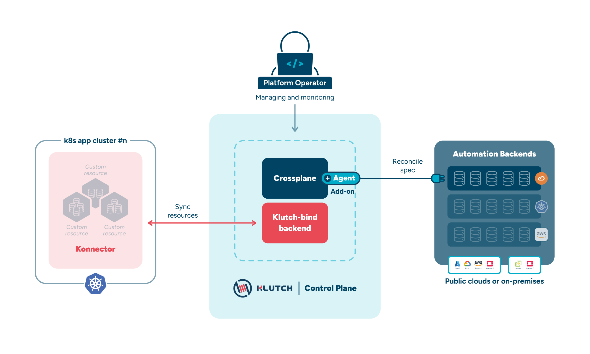

In this page you will explore how developers and platform operators interact with Klutch and discover the key components
that facilitate data service provisioning and management.

## Developer Workflow in the App Cluster

In the App Cluster, developers follow a streamlined process that simplifies data service provisioning and management.
This approach offers an easy, self-service way to provision data services through a unified workflow that supports
different service types across various automation backends.

### 1. Binding to Klutch API (Required once)

In most cases, the platform operator team will have already set up a Klutch-enabled App Cluster (see [App Cluster Setup](../../integrating-ds-in-klutch.md#understanding-the-api-lifecycle-in-klutch)). However, if a developer wants to use a new type of data service
available in their Klutch setup, they can bind to the new Klutch APIs by using the klutch-bind CLI.

The CLI initiates OpenID Connect (OIDC) authentication and, during the first binding request, installs the konnector
into the App Cluster.

The konnector is a lightweight Kubernetes deployment that, creates the necessary Custom Resource Definitions (CRDs) in
the App Cluster. It continuously synchronizes resource specifications and status updates between the App Cluster and the Control Plane Cluster.

### 2. Applying Proxy Claims

After binding to Klutch APIs, developers can apply Proxy Claims just like any other Kubernetes Custom Resource. Simply
define your desired data service, such as a PostgreSQL database, in a YAML manifest and apply it using kubectl.

Proxy Claims provide a unified way to manage various data service types across different automation backends. Inspired
by the Service Broker API, Klutch leverages these key abstractions:

- **Service Instance:** Specify the desired data service you want to provision.
- **Service Binding:** Define which data service to bind. After applying the YAML file with the ServiceBinding, the
necessary credentials and connection details are exposed to the App Cluster.
- **Backup:** Take data service backups.
- **Restore:** Perform restores when needed.

By standardizing how service requests are defined, Proxy Claims simplify resource provisioning and ensure consistency
across deployments.

## Key tasks for Platform Operators in the Control Plane Cluster

The Control Plane Cluster is the central management hub for Klutch, where platform operators are responsible for setting
up, maintaining, and monitoring the entire system.

For detailed instructions on how to set up a Klutch Control Plane Cluster, refer to [this guide](../../platform-operator-guide/setting-up-klutch-clusters/control-plane-cluster/index.md).  

:::tip

Do you want to try Klutch locally without a full-fledged setup?

Follow our [Local Deployment Guide](../../local-deployment-guide.md) to set up a demo sandbox environment on your local
machine.

:::

### Installing and configuring Crossplane® and Providers (Required once)

Klutch leverages Crossplane® to connect the Control Plane to various automation backends. The platform operator team
must install Crossplane® in the Control Plane Cluster and then add the necessary Crossplane® providers (such as
provider-anynines and provider-kubernetes) along with their configuration packages. Additional configuration is required
to enable communication between the Control Plane Cluster and the automation backends.

### Configuring Authentication and API Binding (Required Once)

The klutch-bind backend is essential for verifying authentication requests and enabling API bindings via OIDC. The
platform operator team must configure OIDC authentication using a provider such as Dex or Keycloak to ensure secure user
verification. Following that, the klutch-bind backend is deployed to handle authentication and API binding between App
Clusters and the Control Plane, while ensuring that service accounts and permission models are properly configured for
authorized access. At the end of this process, the API should be exposed and made available for binding to App Clusters.

### Monitoring and Maintenance

Ongoing monitoring and maintenance are critical for ensuring the Control Plane remains secure, efficient, and up-to-date.
Detailed instructions on monitoring capabilities and updating Klutch components are provided in other sections of our
documentation. These guidelines help platform operators track system performance, manage updates, and maintain the
overall health of the Klutch environment.

## Understanding the API Lifecycle in Klutch

Understanding the journey of an API through Klutch stack is crucial for effective management and integration.

1. **API Definition:** The process starts by defining the API in a Crossplane® Configuration Package. When installed in
the Control Plane Cluster, Crossplane® extracts the API definitions.

2. **Making APIs Available to App Clusters:** To share the resource with App Clusters, the platform operator creates an
APIServiceExportTemplate. When an API binding is initiated, the App Cluster generates an APIServiceExportRequest on the
Control Plane Cluster.

3. **Permission Granting and Export Creation:** Upon the creation of the APIServiceExportRequest, the klutch-bind backend
assigns the necessary permissions to the App Cluster's Kubernetes service account for interacting with the requested API
and its associated objects. Subsequently, the klutch-bind backend creates an APIServiceExport object containing a snapshot
of the bound Custom Resource Definition (CRD) at the time of binding.

4. **API Binding Process:** The application developer applies an APIServiceBinding object to their cluster, typically
executed via the kubectl-bind command. The konnector, installed in the App Cluster, detects this event, reads the
APIServiceBinding object, and searches for a corresponding APIServiceExport on the Control Plane Cluster. If a match is
found, the konnector retrieves the API schema from the APIServiceExport and creates a CRD with a matching schema on the
App Cluster. This continuous process accommodates changes and additions of new APIs as they occur.
