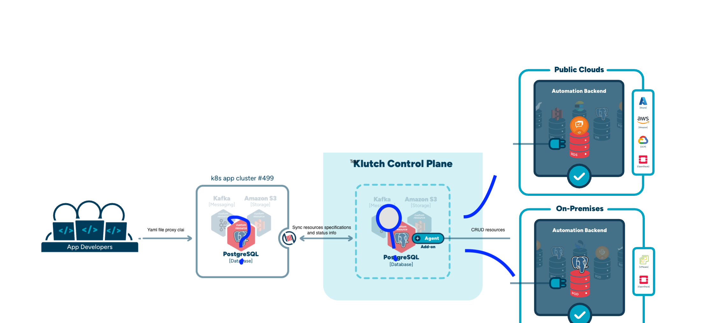

Klutch follows a multi-cluster, client-server paradigm. Developers interact with the App Cluster to request and consume
data services, while platform operators use the Control Plane Cluster to manage and monitor them.

## App Cluster

An App Cluster runs applications and consumes Klutch-managed data services, while the actual data services are
provisioned elsewhere. Developers define their data service requirements by creating Proxy Claims, a Kubernetes Custom
Resource that serves as a resource request. Klutch’s API leverages powerful abstractions to streamline data service
management, covering from resource provisioning to backup and restore processes. When a Proxy Claim is applied, the
request is forwarded to the Control Plane, which provisions the actual resource in an automation backend (such as AWS)
and synchronizes the latest status back to the App Cluster.

## Control Plane Cluster

The Control Plane Cluster is a Kubernetes cluster that serves as the central management hub for Klutch. Platform
operators use it to monitor and manage data services. It facilitates the provisioning of data services across various
automation backends, maintains a catalog of resources, and ensures bidirectional synchronization of resource
specifications, status, and metadata with App Clusters.

In the [following section](./architecture-deep-dive/), we will take a closer look at the Klutch components and how they
facilitate data service management within Klutch.
