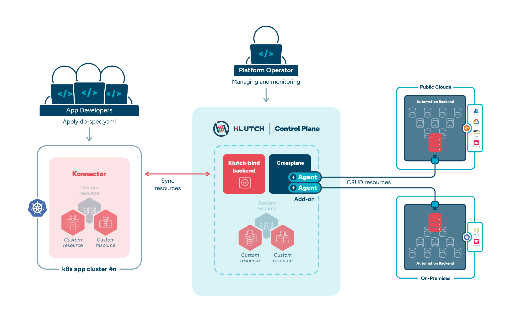

This section covers all the Klutch components that work together to enable its functionality. Klutch follows a
multi-cluster architecture as well as a client-server paradigm and is primarily composed of two clusters: the App
Cluster and the Control Plane Cluster. Depending on the configuration, there can be one or more App Clusters.

Here is the high-level overview of Klutch:

## App Cluster

The App Cluster hosts applications but does not host the data services used by them. Developers create data services
using proxy claims, which are forwarded to the Control Plane Cluster. It is important to note that each App Cluster must
authorize itself with the Control Plane Cluster in order to request the provisioning of data services.

## Control Plane Cluster

Platform operators are responsible for managing the Control Plane Cluster, the central hub of Klutch’s functionality.
This centralized approach benefits platform operators by restricting the management of all data services used within an
organization to a single location. The Control Plane Cluster processes requests from App Clusters, hosts the core
components of Klutch, and handles the provisioning of data services—one of Klutch’s primary features. These services can
be provisioned within the Control Plane Cluster, on external cloud providers, or on-premises, depending on the
requirements. Once provisioned, the Control Plane Cluster is notified of any updates to the data service instance
specifications from the App Cluster and takes the necessary actions to apply the changes accordingly.

In the [following section](./architecture-deep-dive/), we will take a closer look at the Klutch components that reside within both the App Cluster
and the Control Plane Cluster.
