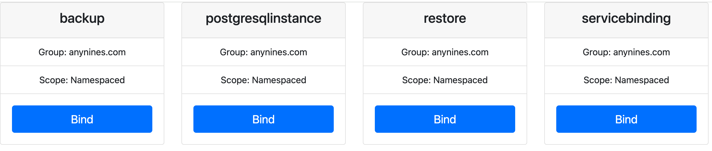
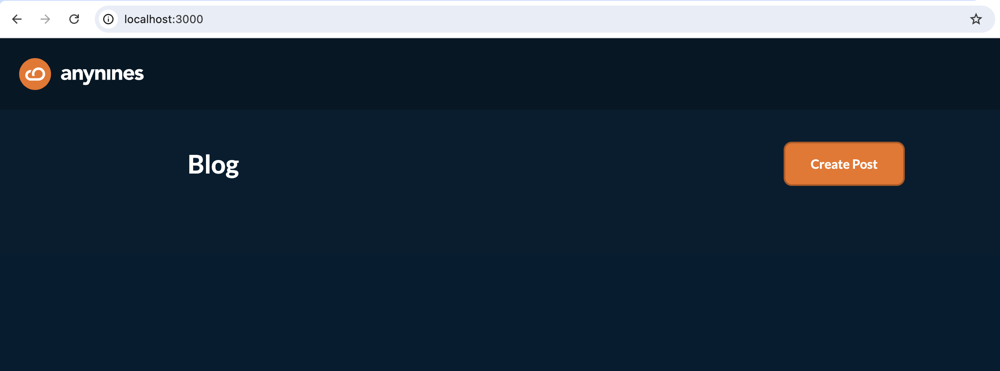

## Local Klutch Deployment

This tutorial guides you through deploying Klutch locally using two interconnected local clusters that simulate a
developer and a central management cluster. It covers setting up both clusters, connecting them using Klutch, and
showcases how developers can request and utilize resources in the developer cluster that are actually provisioned in the
central management cluster.

### Overview

In this tutorial, you'll perform the following steps in your local environment:

1. Deploy a central management cluster (which will also host resources)
2. Set up a developer cluster
3. Bind APIs from the development to Central management cluster
4. Create and use remote resources from the development cluster (in this case Postgresql service)

We'll use the open source [a9s CLI](https://github.com/anynines/a9s-cli-v2) to streamline this process, making it easy
to follow along and understand each step.


## Prerequisites

Before beginning this tutorial, ensure you have the following:

### Required Tools

If you work with Kubernetes regularly, you probably have these standard tools already installed:

1. [Docker](https://docs.docker.com/get-docker/)
2. [Kind](https://kind.sigs.k8s.io/docs/user/quick-start/#installation)
3. [kubectl](https://kubernetes.io/docs/tasks/tools/#kubectl)
4. [Helm](https://helm.sh/docs/intro/install/)
5. [Git](https://git-scm.com/book/en/v2/Getting-Started-Installing-Git)

To follow along with this tutorial, you need to install the following specialized tools:

1. [kubectl-bind](https://docs.k8s.anynines.com/docs/develop/platform-operator/central-management-cluster-setup/#binding-a-consumer-cluster-interactive)
2. [a9s cli](https://docs.a9s-cli.anynines.com/docs/a9s-cli/)

### Network Access

Ensure your machine can reach the following external resources:

1. Configuration: `https://anynines-artifacts.s3.eu-central-1.amazonaws.com/central-management/v1.3.0/crds.yaml`
2. Docker Image Repositories:
   - `public.ecr.aws/w5n9a2g2/anynines/`
   - `dexidp/dex`
   - `curlimages/curl`
   - `xpkg.upbound.io/crossplane-contrib/provider-kubernetes:v0.14.1`

## Step 1: Run the Deployment Command

In this step, we'll set up both the central management cluster and the developer cluster for Klutch using **a single
command**. This command will install all components needed by Klutch, including the a8s framework with the PostgreSQL
operator.

:::note

This step does not automatically create bindings between the developer cluster and the resources in the central
management cluster. You'll need to create these bindings using a web UI in a later step.

:::

Run the following command to set up Klutch on two local clusters.

```bash
a9s klutch deploy --port 8080 --yes
```

:::note

- The ```--port 8080``` flag specifies the port on which the central management cluster's ingress will listen. You can 
  change this if needed.
- The ```--yes``` flag skips all confirmation prompts, speeding up the process.

:::

What this command does:

1. Deploys the central management (producer) cluster with all required components.
2. Installs the [a8s framework](https://k8s.anynines.com/for-postgres/) with the PostgreSQL Kubernetes operator.
3. Creates a developer (consumer) Kind cluster.

:::tip

Remove the ```--yes``` flag if you want to review and approve each step of the process. This can be helpful for
understanding each action the CLI takes.

For a hands-off deployment, keep the `--yes` flag to skip all prompts.

:::

### 1.1 Central Management (Producer) Cluster Deployment

The CLI automatically:

1. Checks prerequisites
2. Creates a Kind cluster named "klutch-management"
3. Deploys core components:
   - ingress-nginx
   - Dex IdP (for authentication)
   - Klutch backend
   - Crossplane and provider-kubernetes
   - Provider configuration package
   - API Service Export Templates
   - [a8s stack](https://k8s.anynines.com/for-postgres/) as a sample data service
   - Minio (for object storage)
   - cert-manager

You'll see progress updates and YAML files being applied for each component.

### 1.2 Developer (Consumer) Cluster Deployment

After setting up the management cluster, the CLI:

- Creates a new Kind cluster named "klutch-consumer"

At the moment this is an empty Kind cluster. Klutch components will be added in the next step, when the consumer 
cluster is "bound" to the central management cluster. Stay tuned!

### Deployment Output

Here's a trimmed example of what you might see during the deployment:

```bash
...
Checking Prerequisites...
✅ Found git at path /usr/bin/git.
✅ Found docker at path /opt/homebrew/bin/docker.
✅ Found kind at path /opt/homebrew/bin/kind.
...

Creating cluster "klutch-management"...
• Ensuring node image (kindest/node:v1.31.0) 🖼  ...
✓ Ensuring node image (kindest/node:v1.31.0) 🖼
• Preparing nodes 📦   ...
✓ Preparing nodes 📦
...

#<Deploying core components>
Applying ingress-nginx manifests...
[YAML content will be displayed here]
✅ ingress-nginx appears to be ready.
Deploying Dex IdP...
[YAML content will be displayed here]
✅ Dex appears to be ready.
...

Applying the a8s Data Service manifests...
...
✅ The a8s System appears to be ready.
...

Deploying a Consumer Kind cluster...
Creating cluster "klutch-consumer" ...
• Ensuring node image (kindest/node:v1.31.0) 🖼  ...
✓ Ensuring node image (kindest/node:v1.31.0) 🖼
• Preparing nodes 📦   ...
...

Summary
You've successfully accomplished the followings steps:
✅ Deployed a Klutch management Kind cluster.
✅ Deployed Dex Idp and the anynines klutch-bind backend.
✅ Deployed Crossplane and the Kubernetes provider.
✅ Deployed the Klutch Crossplane configuration package.
✅ Deployed Klutch API Service Export Templates to make the Klutch Crossplane APIs available to consumer clusters.
✅ Deployed the a8s Stack.
✅ Deployed a consumer cluster.
🎉 You are now ready to bind APIs from the consumer cluster using the `a9s klutch bind` command.

```

## Step 2: Bind Resource APIs from the Consumer Cluster

After setting up both clusters, the next step is to bind APIs from the consumer cluster to the management cluster. We'll
bind two APIs: `postgresqlinstance` and `servicebinding`.

This operation also sets up an agent in the cluster to keep resources in sync between the consumer cluster and the 
central management cluster.

Execute the following command to initiate the binding process:

```bash
a9s klutch bind
```

The CLI automatically:

1. Checks prerequisites
2. Executes the kubectl bind command
3. Directs you to the web UI for authentication and API selection
4. Prompts you to accept the required permissions
5. Confirms binding completion

You'll see progress updates for each step.

### Deployment Output and Binding Process

Here’s a trimmed example of what you might see during the binding process, along with the steps you need to follow to
bind APIs:

```bash
Checking Prerequisites...
✅ Found kubectl at path /opt/homebrew/bin/kubectl.
✅ Found kubectl-bind at path /usr/local/bin/kubectl-bind.
🎉 All necessary commands are present.
...

The following command will be executed for you:
/opt/homebrew/bin/kubectl bind http://192.168.0.91:8080/export --konnector-image public.ecr.aws/w5n9a2g2/anynines/konnector:v1.3.0 --context kind-klutch-consumer
```

Next, a browser window will open for authentication. Use these demo credentials:

- Username: admin@example.com
- Password: password

:::note

In a production environment, use secure, unique credentials.

:::

After authentication, you'll be prompted to select the API to bind. Just click on `Bind` under the API you want to bind.
For our tutorial, let's bind `postgresqlinstance` first.



Back in the terminal, you'll see:

```bash
Created objects will be recreated upon deletion. Accepting this Permission is optional.
Do you accept this Permission? [No,Yes]
...

✅ Created APIServiceBinding postgresqlinstances.anynines.com
...

You've successfully accomplished the following steps:
✅ Called the kubectl bind plugin to start the interactive binding process
✅ Authorized the management cluster to manage the selected API on your consumer cluster.
✅ You've bound the postgresqlinstances resource. You can now apply instances of this resource, for example with the
following yaml:

apiVersion: anynines.com/v1
kind: PostgresqlInstance
metadata:
  name: example-a8s-postgresql
  namespace: default
spec:
  service: "a9s-postgresql13"
  plan: "postgresql-single-nano"
  expose: "Internal"
  compositionRef:
    name: a8s-postgresql
```

To bind to `servicebinding`, repeat the [same process](#step-2-bind-resource-apis-from-the-consumer-cluster), but click
on `Bind` under the `servicebinding` API in the web UI.

## Step 3: Create and Use a PostgreSQL Instance

After binding the PostgresqlInstance, you can create and use PostgreSQL instances in your consumer cluster. This section
will guide you through creating an instance and using it with a simple blogpost application.

### 3.1 Create a PostgreSQL Instance

Create a file named `pg-instance.yaml` with the following content:

```yaml
apiVersion: anynines.com/v1
kind: PostgresqlInstance
metadata:
  name: example-pg-instance
  namespace: default
spec:
  service: "a9s-postgresql13"
  plan: "postgresql-single-nano"
  expose: "Internal"
  compositionRef:
    name: a8s-postgresql
```

<a href="pathname:///tutorial/pg-instance.yaml" target="_blank" download>OR download the yaml manifest</a>

Apply the file to your developer cluster:

```bash
kubectl apply -f pg-instance.yaml
```

### 3.2 Create a ServiceBinding

Next, we'll create a ServiceBinding to make the PostgreSQL credentials available to our application.

Create a file named `service-binding.yaml` with the following content:

```yaml
apiVersion: anynines.com/v1
kind: ServiceBinding
metadata:
  name: example-a8s-postgresql
  namespace: default
spec:
  instanceRef: example-a8s-postgresql
  serviceInstanceType: postgresql
  compositionRef:
    name: a8s-servicebinding
```

<a href="pathname:///tutorial/service-binding.yaml" target="_blank" download>OR download the yaml manifest</a>

Apply the ServiceBinding:

```bash
kubectl apply -f service-binding.yaml
```

### 3.3 Configure Local Network for Testing

Before deploying our application, we need to configure the local network to make the PostgreSQL service available in the
developer cluster. This step is for local testing purposes and may vary significantly in a production environment.

Create a file named `external-pg-service.yaml` with the following content:

```yaml
apiVersion: v1
kind: Service
metadata:
  name: external-pg-service
spec:
  ports:
  - protocol: TCP
    port: 5432
    targetPort: 5432
---
apiVersion: v1
kind: Endpoints
metadata:
  name: external-pg-service
subsets:
- addresses:
  - ip: $(sh -c "if command -v ifconfig >/dev/null 2>&1; then ifconfig | grep 'inet ' | grep -v 127.0.0.1 | awk '{print \$2}' | head -n 1; else ip route get 1 | awk '{print \$7;exit}'; fi")
  ports:
  - port: 5432
```

<a href="pathname:///tutorial/external-pg-service.yaml" target="_blank" download>OR download the yaml manifest</a>

Apply the file:

```bash
kubectl apply -f <(eval "echo \"$(cat external-pg-service.yaml)\"")
```

#### Set up port forwarding in the management cluster

  a. Open a new terminal window.

  b. Switch the kubectl context to the management cluster:

  ```bash
  kubectl config use-context kind-klutch-management
  ```

  c. Set up port forwarding using one of the following methods:

   - Manual method (replace placeholders with actual values):

     ```bash
     kubectl -n <pg namespace> port-forward svc/example-a8s-postgresql-master 5432:5432 --address <your-ip>
     ```

     **OR**

   - Automatic method:
      ```bash
      bash -c 'get_ip() { if [[ "$OSTYPE" == "darwin"* ]]; then ifconfig | grep "inet " | grep -v 127.0.0.1 | awk "{print \$2}" | head -n 1; else ip -4 addr show scope global | grep inet | awk "{print \$2}" | cut -d / -f 1 | head -n 1; fi; }; NAMESPACE=$(kubectl get namespaces -o name | sed "s/^namespace\///" | grep "^kube-bind.*default$"); IP=$(get_ip); [ -z "$NAMESPACE" ] || [ -z "$IP" ] && exit 1; exec kubectl -n "$NAMESPACE" port-forward svc/example-a8s-postgresql-master 5432:5432 --address "$IP"'
      ```

  d. Leave this terminal window running to maintain the port forwarding.

### 3.4 Deploy a Blogpost Application

Now, let's deploy a simple blogpost application that uses our PostgreSQL service. Return to the terminal window where
your **kubectl context** is set to the **developer cluster**.

Create a file named `blogpost-app.yaml` with the following content:

```yaml
apiVersion: apps/v1
kind: Deployment
metadata:
  name: demo-app
  labels:
    app: demo-app
spec:
  replicas: 1
  selector:
    matchLabels:
      app: demo-app
  template:
    metadata:
      labels:
        app: demo-app
        tier: frontend
    spec:
      containers:
        - name: demo-app
          image: anyninesgmbh/a9s-postgresql-app:1.1.0
          imagePullPolicy: Always
          ports:
            - containerPort: 3000
          env:
            - name: "POSTGRESQL_HOST"
              value: external-pg-service
            - name: "POSTGRESQL_USERNAME"
              valueFrom:
                secretKeyRef:
                  name: example-a8s-postgresql-service-binding 
                  key: username
            - name: "POSTGRESQL_PASSWORD"
              valueFrom:
                secretKeyRef:
                  name: example-a8s-postgresql-service-binding 
                  key: password
            - name: "POSTGRESQL_PORT"
              value: "5432"
            - name: "POSTGRESQL_DATABASE"
              valueFrom:
                secretKeyRef:
                  name: example-a8s-postgresql-service-binding 
                  key: database
            - name: "POSTGRESQL_SSLMODE"
              value: "disable"
          resources:
            limits:
              cpu: "0.5"
              memory: 256Mi
---
apiVersion: v1
kind: Service
metadata:
  name: demo-app
spec:
  selector:
      app: demo-app
  ports:
  - port: 3000
```

<a href="pathname:///tutorial/blogpost-app.yaml" target="_blank" download>OR download the yaml manifest</a>

Apply the file:

```bash
kubectl apply -f blogpost-app.yaml
```

### 3.5 Access the Application

To access the application locally:

Set up port forwarding:

```bash
kubectl port-forward svc/demo-app 3000:3000
```

Open your web browser and navigate to http://localhost:3000 to access the blogpost application. You should now see the
blogpost application interface. :tada:




## Step 4: Clean Up Klutch-Created Clusters

If you need to start over or remove the clusters created by Klutch, use the following command:

```bash
a9s klutch delete
```

This command will remove both the management and developer clusters that were created during the Klutch deployment
process.

:::note

Use this command with caution as it will delete all resources and data in both the management and developer clusters.
Make sure to back up any important data before proceeding.

:::
