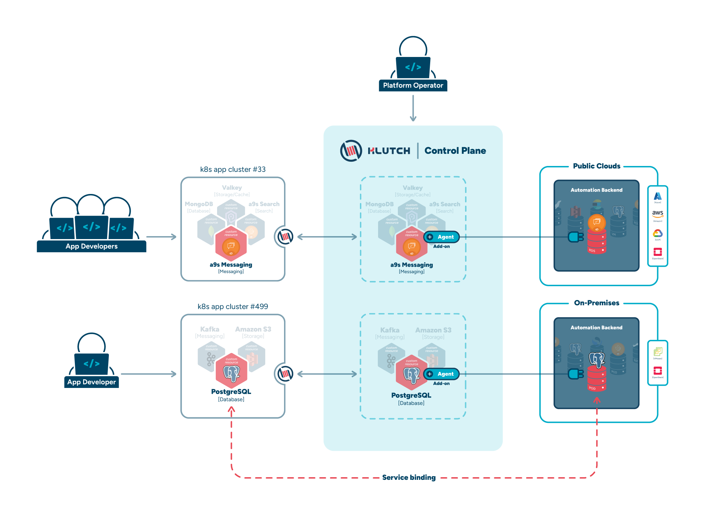

## Meet Klutch

Klutch is an open-source, Kubernetes-native tool designed to simplify data service management across multiple clusters.
It abstracts provisioning and configuration complexities via a standardized interface, ensuring a consistent experience
for managing various data services, such as databases and message brokers, across on-prem, hybrid, and multi-cloud
environments.



## How Klutch works

#### 1. Enable Klutch in your app cluster

To get started, use the klutch-bind CLI. It installs a lightweight component in the application cluster, which
establishes a connection to the Control Plane and enables the provisioning and management of databases and other data
services. The application cluster itself does not run data services.

#### 2. Deploy a data service with YAML

Just like any other Kubernetes resource, define your data service instance in a YAML manifest and apply it using kubectl.

    ```sh
     kubectl apply -f <data-service-manifest>.yaml
    ```

#### 3. Klutch handles provisioning

The Control Plane communicates with automation backends, such as AWS, to create and manage your data services.

#### 4. Access and use the data service

After creating a service binding to a service instance you want to use, connection details and credentials will be
available in the app cluster using Kubernetes-native resources. You can configure your application to connect to the
data service using these credentials.

:::tip

Want to try Klutch right away?

Follow our [Local Deployment Guide](./local-deployment-guide.md) to set up a demo sandbox environment on your machine
and explore Klutch's features.

:::

## Why Klutch?

Managing data services should be simple, regardless of where they are hosted or how complex your environment is. We've
designed Klutch with this vision in mind.

- **Open-source & vendor-neutral** – Developed as an open-source project with a focus on community collaboration and
flexibility, without vendor lock-in.
- **Self-service and automation** – Developers provision and manage data services as code, while platform teams enforce
policies and automation.
- **Scalability without complexity** – Works seamlessly across multi-cluster, multi-cloud environments, providing
centralized control while maintaining local autonomy.
- **Operational efficiency** – Standardizes data service management across Kubernetes clusters, reducing manual effort
and improving DevOps workflows.
- **Centralized control & governance** – Platform operators gain a unified control plane for configuring resource
availability, monitoring usage, and enforcing policies across clusters.

## Built on and beyond Kubernetes-Native technologies

Klutch leverages Crossplane® as a core component but expands on it with additional capabilities that enable self-service
provisioning of data services while maintaining local autonomy for developers and centralized oversight for platform
teams.

The main function of Crossplane® is to connect clusters to automation backends, while the main function of Klutch
is to provide full lifecycle management of data services, which includes features such as taking automatic backups and
restoring any failed data services.

By building on Crossplane®'s strengths, Klutch introduces features that address key limitations and enhance usability:

- **Unified Interface for Data Services** – Inspired by the Open Service Broker API (OSBAPI), Klutch introduces
abstractions such as Service Instances and Service Bindings. It further enhances lifecycle management by making Backup
and Restore first-class abstractions, closing a critical gap in the lifecycle management of data services.

- **Multi-Cluster Support** – Application clusters connect to the Klutch API in the control plane cluster, enabling
self-service provisioning of data services across multiple Kubernetes clusters.

- **Developer Self-Service with Platform Governance** – Developers provision and manage data services using simple YAML
configurations, giving them local control over resources. Meanwhile, platform teams define policies, automation, and
security rules through the Klutch Control Plane to enforce best practices.

- **Centralized Service Discovery and Metadata Management** – The Klutch Control Plane acts as a metadata registry,
tracking all provisioned services and their states across clusters. This provides platform teams with a unified source
of truth for service usage, dependencies, and compliance.

The open-source version of Klutch provides a strong foundation for self-service data service management. While it
delivers essential capabilities for developers and platform teams, it is designed to support additional features, such
as advanced networking, multi-tenancy, and enhanced governance, which are available as part of Klutch’s premium
offerings.

## How Klutch Supports Key Roles in Data Service Management

Let’s explore how Klutch addresses the unique challenges faced by key roles involved in managing and utilizing data
services.

### For Developers

#### Overcoming Infrastructure Complexity

Developers need fast, reliable access to data services without being bogged down by infrastructure complexities.
Traditional manual setups slow down development, while cloud providers burden developers with networking, security, and
configuration details. These distractions keep developers from their core mission – building applications.

##### 🚀 Klutch to The Rescue

Klutch’s Kubernetes-native, declarative interface allows developers to easily define their data service needs using
tools and approaches they’re already comfortable with. Once specified, Klutch handles the provisioning, configuration,
and synchronization. This frees up developers to focus fully on building and deploying applications without the
infrastructure concerns.

### For Platform Operators

#### Managing Data Services at Scale

Platform operators are responsible for ensuring the consistent, secure, and efficient management of data services across
clusters. Keeping track of policies, usage, and reliability across diverse environments can become overwhelming.

##### 🔧 Klutch Makes it Easy

Klutch’s centralized Control Plane provides operators with streamlined oversight and efficient management across
clusters. With Klutch, operators can configure resource availability, monitor usage, and ensure stable system operations
without constant manual intervention.

### For Technical Leaders

#### Balancing Efficiency and Governance

Technical leaders need to optimize resource allocation, uphold service standards, and maintain compliance across
platforms. Limited visibility often hinders strategic decision-making.

##### 💡 Stay Ahead with Klutch

Klutch equips managers with the ability to oversee infrastructure usage and maintain high standards of service delivery.
It features robust observability features for easily tracking metrics, optimizing resource allocation, and making
data-driven decisions to align with strategic goals.

## Community and Support

Together, we can transform cloud data service management! Klutch is an open-source project that unites developers,
operators, and technical leaders in simplifying management of data services across multiple Kubernetes clusters and
cloud providers.

- **Need Assistance?** Browse our [documentation](https://klutch.io/docs/) or connect with us in our [Github Discussions](https://github.com/anynines/klutchio/discussions).
- **Have Ideas or Feedback?** We'd love to hear from you in our [GitHub Discussions](https://github.com/anynines/klutchio/discussions).
- **Found a Bug?** Let's fix it together in our [GitHub repository](https://github.com/anynines/klutchio).
- **First-Time Contributor?** Everyone starts somewhere! Check out our [contributing guide](https://github.com/anynines/klutchio/blob/main/CONTRIBUTING.md) to begin contributing in no time.
