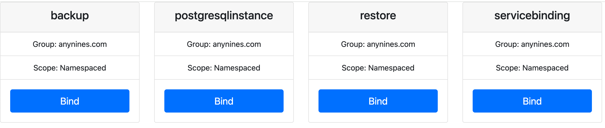

This tutorial walks you through deploying Klutch locally using two interconnected clusters that act as an App Cluster
and a Klutch Control Plane Cluster. Following this guide, and with just a few commands using the [a9s CLI](https://github.com/anynines/a9s-cli-v2),
you’ll set up both clusters, deploy Klutch, bind to Klutch's API from the App Cluster, and see how developers request
resources in the App Cluster while provisioning happens in the Control Plane Cluster.

:::note

In this local setup, we will deploy [a8s PostgreSQL](https://k8s.anynines.com/for-postgres/) in Klutch’s Control Plane
Cluster. However, in many real-world deployments, an automation backend may be used to provision them in remote
infrastructure.

:::

## Requirements

Before starting, ensure that you have the following:

**Required Tools**

If you regularly work with Kubernetes, it is likely that you already have the following standard tools installed:

- [Docker](https://docs.docker.com/get-docker/)
- [Kind](https://kind.sigs.k8s.io/docs/user/quick-start/#installation)
- [kubectl](https://kubernetes.io/docs/tasks/tools/#kubectl)
- [Helm](https://helm.sh/docs/intro/install/)
- [Git](https://git-scm.com/book/en/v2/Getting-Started-Installing-Git)

In addition to these, you will need to install the following specialized tools to proceed with this tutorial:

- [Klutch-bind CLI](./platform-operator-guide/setting-up-klutch-clusters/app-cluster.md#installing-the-klutch-bind-cli) - For creating API bindings
- [a9s CLI](https://github.com/anynines/a9s-cli-v2) -  Helps set up a local environment for Klutch

**Network Access**

Ensure that your machine has access to the following external resources:

- Docker Image Repositories:
  - public.ecr.aws/w5n9a2g2/klutch/
  - dexidp/dex
  - curlimages/curl
  - xpkg.upbound.io/crossplane-contrib/provider-kubernetes

## Deployment Instructions

### 1. Deploying Clusters

Set up both the Klutch Control Plane Cluster and the App Cluster in one step:

```bash
a9s klutch deploy --port 8080 --yes
```

**Flags:**

- --port 8080 sets the ingress port for the Control Plane Cluster (modifiable).
- Removing --yes provides interactive prompts for each step.

The following actions will be performed as a result of this command:

1. Check for requirements.
2. Create a Kind cluster named `klutch-control-plane`
3. Deploy core components in the klutch-control-plane, including:
   - Dex IdP, Klutch-bind backend, Ingress-nginx
   - Crossplane®, Provider-kubernetes, API service export templates
   - [a8s data services](https://k8s.anynines.com/for-postgres/) (a8s PostgreSQL) as an example automation backend,
     Minio (object storage).
4. Create a new Kind cluster named `klutch-app`

Once the command completes, you'll see an output similar to the following:

```bash
Summary

You've successfully accomplished the followings steps:
✅ Deployed a Klutch Control Plane Cluster with Kind.
✅ Deployed Dex Idp and the anynines klutch-bind backend.
✅ Deployed Crossplane and the Kubernetes provider.
✅ Deployed the Klutch Crossplane configuration package.
✅ Deployed Klutch API Service Export Templates to make the Klutch Crossplane APIs available to App Clusters.
✅ Deployed the ass Stack.
✅ Deployed an App Cluster.
🎉 You are now ready to bind APIs from the App Cluster using the 'a9s klutch bind' command.
```

At this point, the App Cluster has not yet bound to Klutch’s APIs in the Control Plane Cluster, this will be set up in
the next step.

### 2. Bind Klutch APIs from the App Cluster

Binding makes Klutch APIs available in the App Cluster. The first time this process runs, it installs the konnector, a
lightweight Kubernetes deployment, which is mainly responsible for keeping resources in sync between the App Cluster and
the Control Plane Cluster.

To bind the APIs, run:

```bash
a9s klutch bind
```

The binding process performs the following steps:

1. Verifies prerequisites
2. Executes kubectl bind

Trimmed output shown below:

```bash
Checking Prerequisites...
✅ Found kubectl at path /opt/homebrew/bin/kubectl.
✅ Found kubectl-bind at path /usr/local/bin/kubectl-bind.
🎉 All necessary commands are present.
...

The following command will be executed for you:
/opt/homebrew/bin/kubectl bind http://192.168.0.91:8080/export \
--konnector-image public.ecr.aws/w5n9a2g2/klutch/konnector:v1.4.0 \
--context kind-klutch-app
```

Opens a browser window for authentication. Use the following credentials to sign in:

     - Username: `admin@example.com`
     - Password: `password`

:::warning

These credentials are intended for local deployment and testing only. Do not use them in production environments.

:::

Prompts you to select an API to bind.

    
    Prompts you to select an API to bind. In this example, bind to the PostgreSQLInstance.

    After selecting the bind you will see the following output in your terminal:

    ```bash
    Created objects will be recreated upon deletion. Accepting this Permission is optional.
    Do you accept this Permission? [No,Yes]
    ...

    ✅ Created APIServiceBinding postgresqlinstances.anynines.com
    ...

    You've successfully accomplished the following steps:
    ✅ Called the kubectl bind plugin to start the interactive binding process
    ✅ Authorized the Control Plane Cluster to manage the selected API on your App Cluster.
    ✅ You've bound the postgresqlinstances resource. You can now apply instances of this resource, for example with the
    following yaml:

    apiVersion: anynines.com/v1
    kind: PostgresqlInstance
    metadata:
      name: example-a8s-postgresql
      namespace: default
    spec:
      service: "a9s-postgresql13"
      plan: "postgresql-single-nano"
      expose: "Internal"
      compositionRef:
        name: a8s-postgresql
    ```

    For this tutorial, also bind the ServiceBinding using the same process. Both the     ServiceBinding and PostgreSQL
    APIs must be bound to continue with the next step.

    Once these bindings are complete, you can create and manage PostgreSQL instances from your App Cluster.

### 3. Create and Use a PostgreSQL Instance

Now, let’s create a PostgreSQL instance and integrate it with a simple blog post application to see Klutch in action.

#### 3.1 Create a PostgreSQL Instance

Begin by defining a PostgreSQL instance in your App Cluster.

Create a file named `pg-instance.yaml` with the following content:

```yaml
apiVersion: anynines.com/v1
kind: PostgreSQLInstance
metadata:
  name: example-pg-instance
  namespace: default
spec:
  service: "a9s-postgresql13"
  plan: "postgresql-single-nano"
  expose: "Internal"
  compositionRef:
    name: a8s-postgresql
```

Deploy the PostgreSQL instance to your App Cluster by running:

```bash
kubectl apply -f pg-instance.yaml
```

#### 3.2 Create a ServiceBinding

To utilize the PostgreSQL database within an application, you'll need to create a ServiceBinding. Applying this
ServiceBinding will generate a Kubernetes Secret in the App Cluster, containing all necessary credentials and
information to connect to the database.

Here's how you can create the ServiceBinding. Create a file named `service-binding.yaml` with the following content:

```yaml
apiVersion: anynines.com/v1
kind: ServiceBinding
metadata:
  name: example-a8s-postgresql
  namespace: default
spec:
  instanceRef: example-pg-instance
  serviceInstanceType: postgresql
  compositionRef:
    name: a8s-servicebinding
```

Deploy the ServiceBinding by executing the following command in your App Cluster:

```bash
kubectl apply -f service-binding.yaml
```

After applying this file, a Kubernetes Secret named `example-pg-instance-service-binding` will be created in the
`default` namespace. This Secret contains the necessary credentials and connection information for your PostgreSQL
database.

#### 3.3 Configure Local Network

To make the PostgreSQL service accessible within the App Cluster, configure your network accordingly. Note that in
production environments, this configuration may differ.

Run the following command to get the local IP address:

```bash
docker inspect -f '{{ (index (index .NetworkSettings.Ports "80/tcp") 0).HostIp }}' klutch-control-plane-control-plane
```

:::note

Take note of this IP address (e.g., `192.168.1.123`), as you will need to use it in the next step when configuring the
service or setting up port forwarding.

:::

Create a file named `external-pg-service.yaml` with the following content. Replace `<your-local-network-ip>` with
the IP address you obtained in the previous step.

```yaml
apiVersion: v1
kind: Service
metadata:
  name: external-pg-service
spec:
  ports:
    - protocol: TCP
      port: 5432
      targetPort: 5432
---
apiVersion: v1
kind: Endpoints
metadata:
  name: external-pg-service
subsets:
  - addresses:
      - ip: <your-local-network-ip>
    ports:
      - port: 5432
```

Run the following command to deploy the service in your App Cluster:

```bash
kubectl apply -f external-pg-service.yaml
```

##### Set Up Port Forwarding in the Klutch Control Plane Cluster

1. Open a new terminal window.
2. Switch the kubectl context to the Klutch Control Plane Cluster:

    ```bash
    kubectl config use-context kind-klutch-control-plane
    ```

3. Forward the PostgreSQL service port (replace placeholders with actual values):

    ```bash
    kubectl -n <pg namespace> port-forward svc/example-a8s-postgresql-master 5432:5432 --address <your-local-network-ip>
    ```

4. Keep this terminal window open to maintain the port forwarding session.

#### 3.4 Deploy a Blog Application

Deploy a simple blog application that interacts with the PostgreSQL service.

Create a file named `blogpost-app.yaml` with the following content:

```yaml
apiVersion: apps/v1
kind: Deployment
metadata:
  name: demo-app
  labels:
    app: demo-app
spec:
  replicas: 1
  selector:
    matchLabels:
      app: demo-app
  template:
    metadata:
      labels:
        app: demo-app
        tier: frontend
    spec:
      containers:
        - name: demo-app
          image: anyninesgmbh/a9s-postgresql-app:1.2.0
          imagePullPolicy: Always
          ports:
            - containerPort: 3000
          env:
            - name: "POSTGRESQL_HOST"
              value: external-pg-service
            - name: "POSTGRESQL_USERNAME"
              valueFrom:
                secretKeyRef:
                  name: example-a8s-postgresql-service-binding 
                  key: username
            - name: "POSTGRESQL_PASSWORD"
              valueFrom:
                secretKeyRef:
                  name: example-a8s-postgresql-service-binding 
                  key: password
            - name: "POSTGRESQL_PORT"
              value: "5432"
            - name: "POSTGRESQL_DATABASE"
              valueFrom:
                secretKeyRef:
                  name: example-a8s-postgresql-service-binding 
                  key: database
            - name: "POSTGRESQL_SSLMODE"
              value: "disable"
          resources:
            limits:
              cpu: "0.5"
              memory: 256Mi
---
apiVersion: v1
kind: Service
metadata:
  name: demo-app
spec:
  selector:
      app: demo-app
  ports:
  - port: 3000
```

Apply the manifest to deploy the application by running the following command in the App Cluster:

```bash
kubectl apply -f blogpost-app.yaml
```

#### 3.5 Access the Application

To access the application locally, set up port forwarding by running the following command in the App Cluster:

```bash
kubectl port-forward svc/demo-app 3000:3000
```

Then, open your browser and go to `http://localhost:3000`. You should see the blogpost application interface. 🎉

At this point, you can start creating blog posts, which will be persisted in the PostgreSQL database managed by Klutch.
We also encourage you to bind additional APIs, such as backup and restore, and try them out to explore more features.

## 4. Clean Up Klutch-Created Clusters

If you need to remove the clusters created by a9s CLI, use:

```bash
a9s klutch delete
```

:::caution

This permanently deletes all resources and data in both the Klutch Control Plane and App Clusters. Be sure to back up
any important data before running this command.
:::
