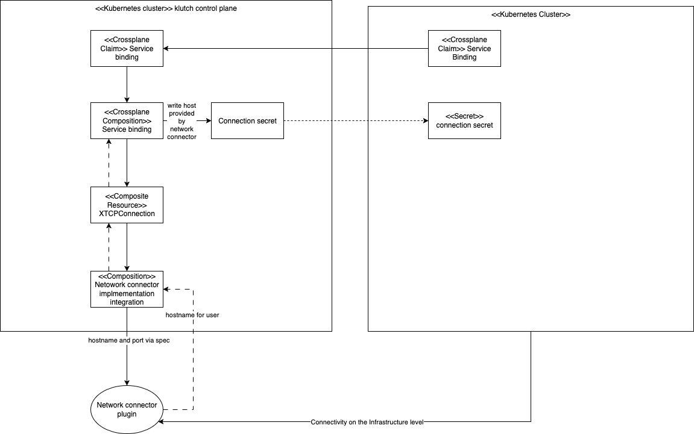

# Klutch network connector Overview

On this page you will learn the purpose of the Klutch network connector and how it works.

## What does the klutch network connector do?

The klutch network connector creates a network path from application clusters to data service
instances that were created by it. A usual Klutch deployment can easily span multiple systems, such
as VPCs or accounts in AWS, projects in openstack, or multiple networks on bare metal. So, by
default we cannot assume that app clusters that are bound to klutch can reach the Data Service
instances provisioned by the Klutch control plane.

Because the creation of a network path between an app cluster and the Data Service instances it
consumes depends on the underlying infrastructure we have developed the klutch network connector as
a plugin system so that users can choose how to best create a path on their infrastructure.

The plugin system is used by Data Service integrations that are provided by anynines but can also be
used by third party integrations.

We provide a default implementation that should work on most infrastructures to help users get
started. This implementation will most likely not be optimal for your environment, so you can create
your own plugin that uses your infrastructure capabilities optimally.

## How the network connector works

<!-- source https://app.diagrams.net/jo#G1NhadMgH9YlkYr3IMkQTCSJyi6zW0y2V7#%7B%22pageId%22%3A%22dwvqTlBXEnC5HFhEO09h%22%7D -->

<!-- draw.io diagram -->


The network connector works by delegating the task of creating a network path to its plugins. It
provides the information on how a Data Service instance can be reached to a Crossplane object
called `XTCPConnection`. The chosen network connector implementation provides a default
[Crossplane Composition](https://docs.crossplane.io/latest/concepts/compositions/) for the `XTCPConnection`
object.

The network connector can be invoked by all backend integrations that want to expose private connection endpoints so that app clusters can use them. In the a9s data services it is not yet enabled by default but can be used by using the compositionRef *TODO* in the service binding. The service binding crossplane composition then creates a `XTCPConnection` and automatically updates the connection secret, so that the user receives the connection details as they are implemented by the respective network connector implementation.

To make use of the network connector in your own integrations, please refer to the [data service integration guide](./integrating-ds-in-klutch.md).

### Understanding Crossplane Concepts

Before diving deeper, it's helpful to understand some key Crossplane concepts:

- **[Composite Resource Definitions (XRDs)](https://docs.crossplane.io/latest/concepts/composite-resource-definitions/)**: Define the schema for composite resources like `XTCPConnection`. They specify what fields users can configure and what fields the system exposes.
- **[Compositions](https://docs.crossplane.io/latest/concepts/compositions/)**: Templates that describe how to provision infrastructure resources when a composite resource is created. Compositions can orchestrate multiple managed resources from different providers.
- **[Managed Resources](https://docs.crossplane.io/latest/concepts/managed-resources/)**: Resources that represent actual cloud or infrastructure resources managed by Crossplane providers.
- **[Providers](https://docs.crossplane.io/latest/concepts/providers/)**: Plugins that extend Crossplane to manage specific cloud services or infrastructure (e.g., AWS, Azure, Kubernetes).

For comprehensive information, see the [Crossplane Concepts documentation](https://docs.crossplane.io/latest/concepts/).

### XTCPConnection Resource

The `XTCPConnection` composite resource serves as the bridge between service instances and application clusters:

- **Input**: The composition receives the host and port of a data service instance in the resource's `spec` field
- **Processing**: The chosen network connector implementation uses the composition to create appropriate resources:
  - Directly provision cloud resources via Crossplane providers
  - Interact with custom Crossplane providers
  - Create Kubernetes objects that are reconciled by controllers
- **Output**: The status of the `XTCPConnection` contains the values that the implementation returns (e.g., rewritten host/port if necessary)

The implementation may choose to rewrite the host or port if required, but it can also leave them unchanged if the underlying infrastructure allows direct connectivity.

## Plugin System and Custom Implementations

The network connector is designed with extensibility in mind. While Klutch provides a default proxy-based implementation, you can create custom implementations tailored to your infrastructure.

### When to Use Custom Plugins

- **Optimized connectivity**: Your infrastructure supports VPN, peering, or direct networking between clusters
- **Cost optimization**: Reducing traffic through a central proxy to save on data transfer costs
- **Specialized networking**: Requirements for direct connections, mesh networking, or proprietary solutions
- **Multi-region deployments**: Optimized routing across geographic regions

### Building Custom Plugins

Custom plugins should implement the same `XTCPConnection` pattern by providing their own Crossplane Composition. This composition receives the data service connection details and returns rewritten connection information appropriate for your infrastructure.

Key considerations when implementing custom plugins:

1. **Composition Design**: Follow Crossplane composition best practices (see [Composition Authoring Guide](https://docs.crossplane.io/latest/concepts/compositions/))
2. **Resource Management**: Ensure proper cleanup of network resources when `XTCPConnection` resources are deleted
3. **Status Reporting**: Properly report connection details in the resource status for consumer clusters
4. **Error Handling**: Implement robust error handling and status conditions

# Network connector API

## Design

The API is Crossplane-centric, using a shared Composite Resource Definition (XRD) as the interface for implementations. Implementations provide a Crossplane composition that implements the XRD. Compositions can use the information provided in the XRD to implement connectivity in any suitable way, such as:

- Composing cloud-specific resources (AWS VPC peerings, routes)
- Kubernetes resources (via the Crossplane Kubernetes provider)
- Custom implementations for on-premises environments (via custom Crossplane providers)

To allow users to opt out of using a network connection solution, Klutch provides a NOOP composition that accepts the XRD and takes no action.

### Core API

The core API contains the minimum set of information needed by a network connector implementation to enable connectivity. Klutch always populates these fields:

```yaml
apiVersion: klutch.anynines.com/v1
kind: TCPConnection
spec:
  instanceHost: <string>     # required
  port: <uint16>             # required
status:
  hostForConsumer: <string>  # required
  port: <uint16>             # required
  conditions: []             # see Kubernetes conditions
```

Each data service instance port gets its own `TCPConnection` resource. For example, a PostgreSQL instance may expose both the database port and a dashboard on different ports or hosts. Rather than pooling these concerns, separate `TCPConnection` resources keep the interface simple and allow different configurations per port.

### Enhancement Information

Optional fields help implementations achieve better instance-specific connectivity, such as SNI for routing multiple instances to the same proxy port or integration with service meshes. Implementations should fall back to core fields if enhancements are unavailable.

If a field later becomes necessary and can be safely provided by all Klutch automation backends, a new API revision makes it required. When this occurs, the field moves out of the enhancements array. If migration is not possible, platform operators must ensure fields are populated and all requirements are met for service availability.

Example enhancement structure:

```yaml
spec:
  host: <host>
  port: <port>
  enhancements:
    - InstanceType: PostgreSQL
    - ConnectionType: wireguardVPN
      vpnEndpoint: <endpoint>
      clientIP: <ip>
    - ConnectionType: istioMesh
      meshID: <id>
    - ConnectionType: awsVPCPeering
      instanceVPC: <vpc-id>
      appClusterVPC: <vpc-id>
```

Enhancement types include:

- **InstanceType**: Based on instance software (e.g., PostgreSQL, RabbitMQ)
- **ConnectionType**: Based on the connection method (e.g., wireguardVPN, istioMesh, awsVPCPeering)

Each type has a defined schema with required and optional fields.


### Status Conditions

**Coming soon**

The `conditions` field follows [Kubernetes condition conventions](https://kubernetes.io/docs/concepts/workloads/pods/pod-lifecycle/#pod-conditions).

**Required Condition Types:**
- `Ready`: True when the connection is established and ready for use

**Example:**
```yaml
status:
  conditions:
    - type: Ready
      status: "True"
      reason: ConnectivityEstablished
      message: "TCP connection available at proxy.example.com:30001"
```


## Next Steps

- Check the [Crossplane Concepts documentation](https://docs.crossplane.io/latest/concepts/) for architectural understanding
- Explore how [Klutch integrates data services](../integrating-ds-in-klutch.md) with the network connector
