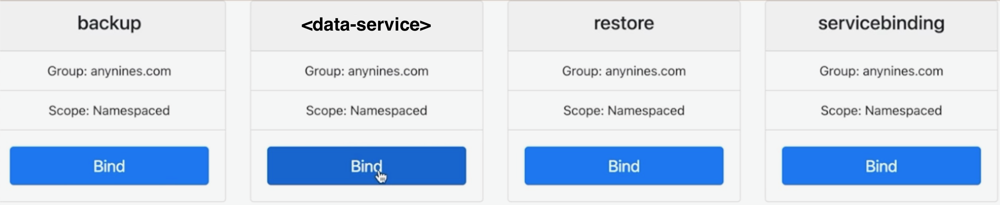

import Tabs from '@theme/Tabs'; import TabItem from '@theme/TabItem';

## Set up a tenant cluster

We use klutch-bind to make the a9s Kubernetes API available inside a tenant cluster. In order to
utilize the `kubectl bind` command, you'll need to have the `kubectl-bind` binary installed and
properly added to your system's path. Download the appropriate `kubectl-bind` binary for your
system's architecture from the provided options:

:::info

Make sure to use the binary from one of the links below, as the current release on GitHub is
outdated and does not provide all features required!

:::

<Tabs>
<TabItem value="tab1" label="MacOS" default>

Download links:

- [amd64](https://anynines-artifacts.s3.eu-central-1.amazonaws.com/central-management/v1.3.0/darwin-amd64/kubectl-bind)
- [arm64](https://anynines-artifacts.s3.eu-central-1.amazonaws.com/central-management/v1.3.0/darwin-arm64/kubectl-bind)

Open the folder to where you downloaded the file and open a terminal window

I. Create a new directory to add to your PATH environment variable

```bash
 mkdir -p <installation-directory>/bin
```

II. Give the folder executable permission

```bash
chmod 755 <installation-directory>/bin
```

III. Copy the binary to the newly created folder

```bash
cp ./kubectl-bind <installation-directory>/bin
```

IV. Add the path to PATH environment variable

```bash
export PATH=$PATH:<installation-directory>/bin
```

V. If everything is configured correctly you should see some output when you run the following
command

```bash
kubectl bind
```

:::caution

When running the command above, you might encounter the error message:

**'kubectl-bind' can't be opened because Apple cannot check it for malicious software.**

To resolve this error, you can follow the instructions provided
[here](https://support.apple.com/en-lk/guide/mac-help/mchleab3a043/mac).

:::

</TabItem>
<TabItem value="tab2" label="Linux">

Download links:

- [i386](https://anynines-artifacts.s3.eu-central-1.amazonaws.com/central-management/v1.3.0/linux-386/kubectl-bind)
- [amd64](https://anynines-artifacts.s3.eu-central-1.amazonaws.com/central-management/v1.3.0/linux-amd64/kubectl-bind)

Open the folder to where you downloaded the file and open a terminal window

I. Create a new directory to add to your PATH environment variable

```bash
 mkdir -p <installation-directory>/bin
```

II. Give the folder executable permission

```bash
chmod 755 <installation-directory>/bin
```

III. Copy the binary to the newly created folder

```bash
cp ./kubectl-bind <installation-directory>/bin
```

IV. Add the path to PATH environment variable

```bash
export PATH=$PATH:<installation-directory>/bin
```

V. If everything is configured correctly you should see some output when you run the following
command

```bash
kubectl bind
```

</TabItem>
<TabItem value="tab3" label="Windows">

Download links:

- [i386](https://anynines-artifacts.s3.eu-central-1.amazonaws.com/central-management/v1.3.0/windows-386/kubectl-bind.exe)
- [amd64](https://anynines-artifacts.s3.eu-central-1.amazonaws.com/central-management/v1.3.0/windows-amd64/kubectl-bind.exe)

Open the folder to where you downloaded the file and open a terminal window

I. Create a directory anywhere you feel is appropriate and move the executable to that folder.

II. Copy the path of the folder containing the executable.

III. Right-click My Computer(either on the Desktop or the Start menu) and click Properties.

IV. In the System Properties dialog box, click the Advanced tab and click Environment Variables.

V. In the top list, scroll down to the PATH variable, select it, and click Edit. Click New and enter
PATH for the Variable Name. In the Variable Value box, scroll to the end of the variable. If there
is no semi-colon (;) at the end of the current path, add one, and then enter the path to the
executable folder. Finally, click OK.

VI. If everything is configured correctly you should see some output when you run the following
command

```bash
kubectl bind
```

</TabItem>
</Tabs>

---

We proceed by binding the tenant cluster with the Klutch backend. This will allow users of the
tenant cluster to set up new data service instances in the environment managed by the Klutch
backend. To create this binding, execute the following commands:

1. In the following line, replace `<backend-host>` with the hostname of the Klutch backend:

   ```bash
   kubectl bind http://<backend-host>:443/export --konnector-image=public.ecr.aws/w5n9a2g2/anynines/konnector:v1.3.0
   ```

2. Authenticate using provided URL and your OIDC credentials. Grant the OIDC client access in the
   browser that was oppened and respond `Yes` in the terminal to grant required access. Bind one at
   a time by using `kubectl bind` and logging in via the browser.

You can select the service to bind by using the web UI, as shown in the following image:



And that's it, you have now successfully configured both the provider and tenant clusters.

# Install Konnector without klutch-bind CLI

When provisioning a tenant cluster from an automated CI flow, it may be desirable to avoid
additional dependencies like the `kubectl bind` CLI binary or the anynines `helper` CLI. For those
cases it is possible to deploy the `Konnector` component using a plain Kubernetes manifest.

:::note

These steps will only install the generic Konnector component. They will not bind the tenant cluster
to the central management cluster yet.

:::

## Deploying Konnector

The manifests to apply can be found in the codeblock below.

Before applying them, make sure replace the `image` with the latest one if necessary. The latest one
can always be found in this documentation or by checking out the tab "Image tags" for this image in
our [image registry](https://gallery.ecr.aws/w5n9a2g2/anynines/konnector).

```yaml
apiVersion: v1
kind: Namespace
metadata:
  name: klutch-bind
---
apiVersion: rbac.authorization.k8s.io/v1
kind: ClusterRole
metadata:
  name: klutch-bind-konnector
rules:
  - apiGroups:
      - "*"
    resources:
      - "*"
    verbs:
      - "*"
---
apiVersion: rbac.authorization.k8s.io/v1
kind: ClusterRoleBinding
metadata:
  name: klutch-bind-konnector
roleRef:
  apiGroup: rbac.authorization.k8s.io
  kind: ClusterRole
  name: klutch-bind-konnector
subjects:
  - kind: ServiceAccount
    name: konnector
    namespace: klutch-bind
---
apiVersion: v1
kind: ServiceAccount
metadata:
  name: konnector
  namespace: klutch-bind
---
apiVersion: apps/v1
kind: Deployment
metadata:
  name: konnector
  namespace: klutch-bind
  labels:
    app: konnector
spec:
  replicas: 2
  selector:
    matchLabels:
      app: konnector
  template:
    metadata:
      labels:
        app: konnector
    spec:
      restartPolicy: Always
      serviceAccountName: konnector
      containers:
        - name: konnector
          # Make sure to use the latest image version here:
          image: public.ecr.aws/w5n9a2g2/anynines/konnector:v1.3.0
          env:
            - name: POD_NAME
              valueFrom:
                fieldRef:
                  fieldPath: metadata.name
            - name: POD_NAMESPACE
              valueFrom:
                fieldRef:
                  fieldPath: metadata.namespace
```

## Updating Konnector

In order to update an existing Konnector deployment with a new version, simply reapply the
`Deployment` manifest, with the new image version.

Example (fictional image version):

```yaml
apiVersion: apps/v1
kind: Deployment
metadata:
  name: konnector
  namespace: klutch-bind
  labels:
    app: konnector
spec:
  replicas: 2
  selector:
    matchLabels:
      app: konnector
  template:
    metadata:
      labels:
        app: konnector
    spec:
      restartPolicy: Always
      serviceAccountName: konnector
      containers:
        - name: konnector
          # Replace this with the new image version:
          image: public.ecr.aws/w5n9a2g2/anynines/konnector:v3.141.59
          env:
            - name: POD_NAME
              valueFrom:
                fieldRef:
                  fieldPath: metadata.name
            - name: POD_NAMESPACE
              valueFrom:
                fieldRef:
                  fieldPath: metadata.namespace
```
